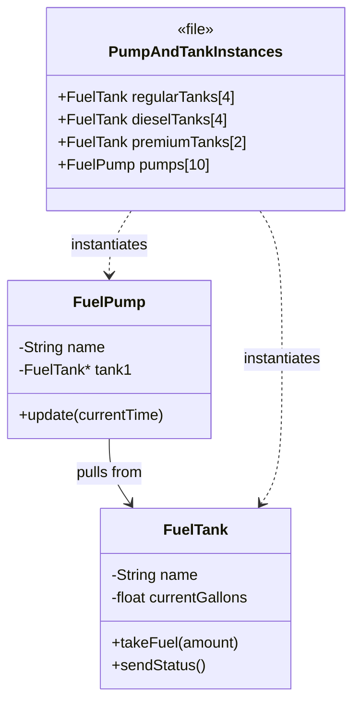
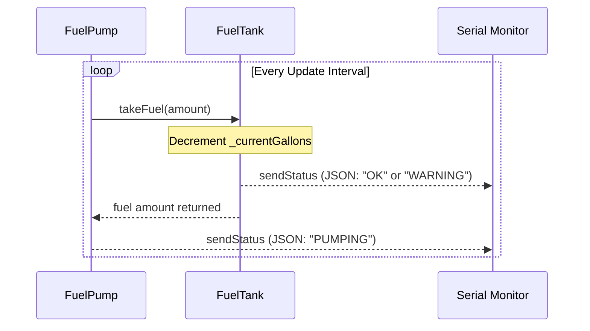
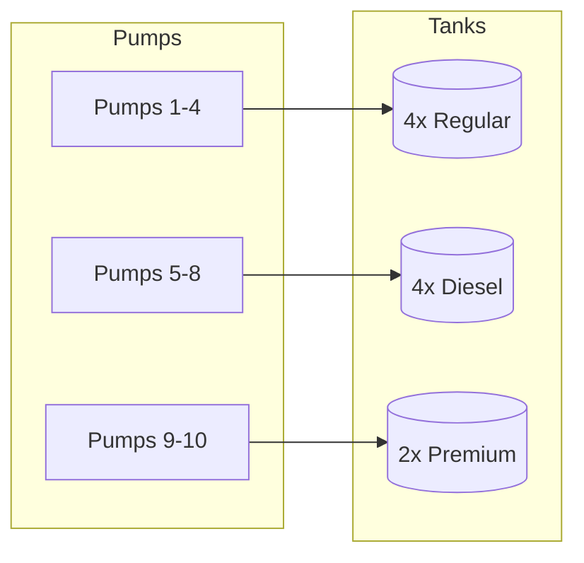

#### 2. Pumping Logic (Sequence Diagram)
This illustrates the "inventory removed from respective tank" logic we implemented, including the immediate feedback loop.

#### 3. Tank Mapping (Flow Chart)
A quick view of the distribution logic we finalized.

